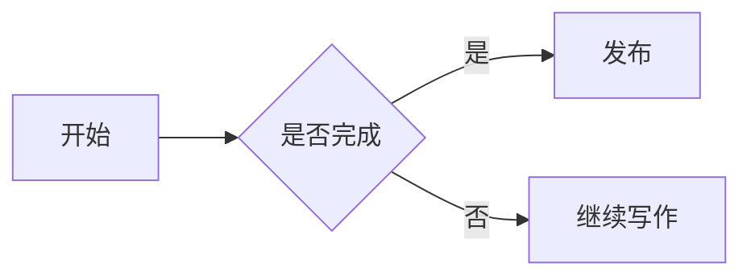

> [!TIP]
> 本站基于 [Firefly](https://github.com/CuteLeaf/Firefly) 主题构建（Astro 静态博客）。
> 核心思路：**站上的一切内容都是"文件"**——文章和动态是 Markdown 文件，友链/相册/导航是配置文件。
> 你只需要学会"在哪个目录放什么文件"，就能完全掌控这个网站。

---

## 📖 目录

1. [内容类型总览](#内容类型总览)
2. [本地运行与预览](#本地运行与预览)
3. [发布文章（核心）](#发布文章核心)
4. [发布动态](#发布动态)
5. [修改特殊页面（关于 / 友链 / 留言）](#修改特殊页面关于--友链--留言)
6. [管理相册](#管理相册)
7. [管理友链](#管理友链)
8. [自定义导航栏](#自定义导航栏)
9. [其他站点配置速查](#其他站点配置速查)
10. [Markdown 增强语法](#markdown-增强语法)
11. [发布到线上](#发布到线上)
12. [常见问题 FAQ](#常见问题-faq)

---

## 内容类型总览

| 内容 | 存放位置 | 添加方式 |
|---|---|---|
| 📝 文章 | `src/content/posts/` | 新建 `.md` / `.mdx` 文件（或 `pnpm new-post`） |
| 💬 动态（说说） | `src/content/dynamic/` | 新建 `.md` 文件（或 `pnpm new-d`） |
| 👤 关于我 | `src/content/spec/about.md` | 直接编辑 |
| 🔗 友链列表 | `src/config/friendsConfig.ts` | 配置数组加一项 |
| 📸 相册 | `public/gallery/<相册id>/` + `src/config/galleryConfig.ts` | 建目录放图 + 注册配置 |
| 🧭 导航栏 | `src/config/navBarConfig.ts` | 增删链接 |
| 📢 公告 / 🎵 音乐 / 💰 打赏等 | `src/config/` 下各配置文件 | 按需修改 |

**重要提示**：本站是纯静态站点，没有后台管理系统。每次修改内容后：

- 本地开发时：保存文件即生效（开发服务器自动刷新）；
- 发布上线：需要 `git` 提交并推送，托管平台（Vercel / Cloudflare Pages 等）会自动重新构建。

---

## 本地运行与预览

### 环境要求

- **Node.js ≥ 22**
- **pnpm ≥ 9**（包管理器，项目强制使用）

### 首次安装与启动

```bash
# 1. 安装依赖（首次使用）
pnpm install

# 2. 启动本地开发服务器
pnpm dev
```

浏览器打开 **http://localhost:4321** 即可实时预览。修改任何内容文件后，页面会自动热更新。

> [!NOTE]
> 修改 `src/config/` 下的配置文件后，需要**重启** `pnpm dev` 才会生效（配置只在启动时读取）。

---

## 发布文章（核心）

### 方式一：命令行脚手架（推荐）

在项目根目录执行：

```bash
pnpm new-post 我的第一篇博客文章
```

脚本会自动在 `src/content/posts/` 下创建 `我的第一篇博客文章.md`，并生成 Frontmatter 骨架，你只需打开文件填写内容。

### 方式二：手动创建

在 `src/content/posts/` 下新建一个 `.md` 文件（纯 Markdown 用 `.md`，想嵌入组件用 `.mdx`），按下面的模板填写：

```markdown
---
title: 我的第一篇博客文章
published: 2026-08-16
description: 这篇文章的简短描述，会显示在首页卡片和搜索摘要中。
image: ./cover.avif
tags: [生活, 教程]
category: 随笔
draft: false
pinned: false
lang: ""
comment: true
# password: "123456"
# passwordHint: "提示：六位数字"
# slug: my-first-post
---

正文从这里开始，使用标准 Markdown 语法……
```

### Frontmatter 字段详解

| 字段 | 必填 | 说明 | 示例 |
|---|---|---|---|
| `title` | ✅ | 文章标题 | `我的第一篇博客文章` |
| `published` | ✅ | 发布日期，格式 `YYYY-MM-DD` | `2026-08-16` |
| `description` | | 文章摘要，显示在首页卡片 | `这是一篇示例文章` |
| `image` | | 封面图路径，见下方"三种写法" | `./cover.avif` |
| `tags` | | 标签数组，用于标签页聚合 | `[前端, 教程]` |
| `category` | | 分类，用于分类页聚合 | `技术分享` |
| `draft` | | `true` = 草稿，不会出现在站点上 | `false` |
| `pinned` | | `true` = 置顶到文章列表顶部 | `false` |
| `lang` | | 文章语言代码，仅当与站点默认语言不同时填写 | `zh-CN` / `en` / `ja` |
| `updated` | | 更新日期，不填则默认等于发布日期 | `2026-08-20` |
| `author` | | 自定义作者名（默认用站点配置的作者） | `夏叶` |
| `sourceLink` | | 内容来源链接（转载/参考时用） | `https://example.com` |
| `licenseName` / `licenseUrl` | | 文章许可协议名称与链接 | `CC BY-NC 4.0` |
| `comment` | | 是否开启评论，默认 `true` | `false` |
| `slug` | | 自定义 URL；不填则用文件名 | `my-first-post` |
| `password` | | 设置后文章加密，访客需输入密码 | `123456` |
| `passwordHint` | | 密码提示，显示在密码输入框上方 | `六位数字` |

### 封面图 `image` 的三种写法

1. **网络图片**：以 `http://` 或 `https://` 开头
   ```yaml
   image: https://example.com/cover.jpg
   ```
2. **public 目录**：以 `/` 开头，对应 `public/` 下的文件
   ```yaml
   image: /gallery/my-trip/1.jpg
   ```
3. **相对路径**（推荐）：不带前缀，相对于文章所在目录
   ```yaml
   image: ./cover.avif
   ```
   图片与文章放在同一目录即可。
4. **随机封面**：填 `"api"` 可启用随机封面（需在 `src/config/coverImageConfig.ts` 配置图源）

> [!TIP]
> 封面图建议使用 `.avif` 或 `.webp` 压缩格式，加载更快。构建时系统会自动为图片生成模糊占位（LQIP）。

### 文章 URL（Slug）规则

| 情况 | 结果 URL |
|---|---|
| 文件 `my-first-post.md`，不填 slug | `/posts/my-first-post` |
| 文件 `my-first-post.md`，`slug: hello-world` | `/posts/hello-world` |
| 中文文件名，`slug: how-to-use` | `/posts/how-to-use` |

注意事项：

- 文件名建议用**英文小写 + 连字符**（如 `my-first-post.md`）；
- 中文文件名务必设置英文 `slug`，否则 URL 会是一串编码；
- slug 发布后**不要随意更改**，以免影响 SEO 和已有外链；
- slug 会自动转为小写；多个文章使用相同 slug 时后写的会覆盖先写的。

### 用子目录组织文章和素材

文章多起来后，可以用子目录把正文和素材放一起，方便管理：

```
src/content/posts/
├── my-first-post.md          # → /posts/my-first-post
└── a-project/
    ├── cover.avif            # 素材与正文同目录
    ├── screenshot.png
    └── index.md              # → /posts/a-project
```

### 草稿模式

把 `draft: true`，文章就不会出现在站点任何地方（列表、搜索、RSS 都不会有），但本地开发时仍可访问 `/posts/<slug>` 预览。写完后改为 `false` 即发布。

### 置顶文章

`pinned: true` 会把文章固定到文章列表顶部。多篇置顶时按发布时间排序。

### 加密文章

设置 `password` 后，文章正文会被 **AES-256-GCM** 加密，访客输入正确密码才能查看（密码存于构建产物中，属于"防君子不防小人"的轻量保护）：

```yaml
password: "123456"
passwordHint: "提示：六位数字"
```

> [!WARNING]
> 加密文章的搜索索引默认会排除正文内容，避免密码泄露在搜索中。

---

## 发布动态

动态（说说/碎碎念）适合发短内容，显示在"动态"页面。

### 命令行（推荐）

```bash
# 一条命令创建动态，内容直接写在命令里
pnpm new-d 今天心情不错，出去吃了一顿火锅

# 完整写法，两者完全等价
pnpm new-dynamic 今天心情不错，出去吃了一顿火锅
```

### 手动创建

在 `src/content/dynamic/` 下新建 `.md` 文件，文件名建议用时间戳（如 `2026-08-16-120000.md`）：

```markdown
---
published: 2026-08-16 12:00:00
pinned: false
location: 北京
---

动态正文，支持 Markdown 语法，比如 **加粗**、`代码`、[链接](https://example.com)。
```

- `published`：发布时间，精确到秒；
- `pinned`：置顶；
- `location`：位置信息，会显示在动态卡片上。

### 对接 Memos（可选）

在 `src/config/dynamicConfig.ts` 中开启 `memos.enable: true` 并填写实例地址，即可直接用 [Memos](https://www.usememos.com/) 发动态，站点实时同步（需在 Memos 中配置 CORS）。

---

## 修改特殊页面（关于 / 友链 / 留言）

这些页面的内容就是普通 Markdown 文件，**直接用编辑器修改保存即可**：

| 文件 | 页面 |
|---|---|
| `src/content/spec/about.md` | "关于我"页面 |
| `src/content/spec/friends.mdx` | 友链页（顶部列表由 `friendsConfig.ts` 生成，此文件内容显示在页面底部） |
| `src/content/spec/guestbook.md` | 留言页面 |

例如在 `about.md` 里追加一段自我介绍，保存后刷新页面即可看到。

---

## 管理相册

添加一个相册需要**两步**：

### ① 准备图片

在 `public/gallery/` 下创建目录，目录名要与配置中的 `id` 一致，把图片放进去：

```
public/gallery/my-trip/
├── 1.jpg
├── 2.webp
├── 3.avif
└── cover.jpg        # 可选：封面图；没有则自动用第一张
```

支持 `jpg / png / webp / avif / gif` 格式。

> 图片很多或存放在图床时，可以不直接放文件，而是在目录里建一个 `urls.txt`，每行一个图片 URL（`#` 开头为注释行）：
>
> ```
> # 每行一个图片 URL，支持 jpg/png/webp/avif/gif 后缀
> https://s41.ax1x.com/2026/05/13/peXyh79.jpg
> https://s41.ax1x.com/2026/05/13/peXshJP.webp
> ```

### ② 注册相册

编辑 `src/config/galleryConfig.ts`，在 `albums` 数组里追加一项：

```typescript
{
  id: "my-trip",            // 必须与 public/gallery/ 下的目录名一致
  name: "我的旅行",          // 相册名称
  description: "去云南拍的照片", // 描述
  location: "云南",          // 拍摄地点
  date: "2026-08-01",       // 日期 YYYY-MM-DD，用于排序
  tags: ["旅行", "云南"],    // 标签，用于筛选
  // password: "123456",    // 可选：加密相册
  // passwordHint: "六位数字",
},
```

> [!NOTE]
> 修改配置后记得**重启 `pnpm dev`** 才能看到效果。

---

## 管理友链

编辑 `src/config/friendsConfig.ts`，在 `friendsConfig` 数组末尾追加：

```typescript
{
  title: "朋友的博客",                       // 名称
  imgurl: "https://example.com/avatar.png", // 头像地址
  desc: "一句简短的介绍",                     // 描述
  siteurl: "https://example.com",           // 站点地址
  tags: ["Blog"],                            // 标签
  weight: 10,                                // 权重，数字越大排序越靠前
  enabled: true,                             // false 则暂时隐藏
},
```

友链页顶部的排序方式、是否显示评论区等，可在同一文件的 `friendsPageConfig` 中调整。

---

## 自定义导航栏

编辑 `src/config/navBarConfig.ts`。导航栏由 `links` 数组按顺序生成，支持：

- **单链接**：
  ```typescript
  { name: "关于我", url: "/about/", icon: "material-symbols:person" }
  ```
- **带子菜单的链接**（如"文章"下拉菜单）：
  ```typescript
  {
    name: "文章",
    url: "#",
    icon: "material-symbols:article",
    children: [
      LinkPresets.Archive,     // 归档
      LinkPresets.Categories,  // 分类
      LinkPresets.Tags,        // 标签
    ],
  }
  ```

`LinkPresets` 里内置了常用页面（主页、归档、分类、标签、友链、留言等），直接引用即可。图标使用 Iconify 图标名，可在 [iconify.design](https://iconify.design) 查找。

---

## 其他站点配置速查

所有配置都在 `src/config/` 目录下，文件名即用途：

| 配置文件 | 用途 |
|---|---|
| `siteConfig.ts` | 站点名称、描述、语言、分页、主题色等核心配置 |
| `profileConfig.ts` | 头像、昵称、个人简介 |
| `navBarConfig.ts` | 导航栏 |
| `sidebarConfig.ts` | 侧边栏布局与小组件顺序 |
| `backgroundWallpaper.ts` | 首页背景壁纸 |
| `announcementConfig.ts` | 顶部公告栏 |
| `commentConfig.ts` | 评论系统（Twikoo 等） |
| `analyticsConfig.ts` | 统计（Google Analytics / Umami 等） |
| `friendsConfig.ts` | 友链 |
| `galleryConfig.ts` | 相册 |
| `musicConfig.ts` | 音乐播放器与歌单 |
| `sponsorConfig.ts` | 打赏（支付宝/微信收款码） |
| `footerConfig.ts` | 页脚内容 |
| `licenseConfig.ts` | 站点许可协议 |
| `pioConfig.ts` | 看板娘（Live2D） |
| `effectsConfig.ts` | 樱花飘落等页面特效 |
| `fontConfig.ts` | 字体 |
| `displaySettingsConfig.ts` | 设置面板选项 |
| `dynamicConfig.ts` | 动态页配置与 Memos 对接 |
| `coverImageConfig.ts` | 随机封面图源 |
| `expressiveCodeConfig.ts` | 代码高亮主题 |

> [!TIP]
> 每个配置文件顶部都有详细的中文注释，照着注释改即可，无需看文档。

---

## Markdown 增强语法

正文除了标准 [GFM 语法](https://github.github.com/gfm/)（表格、代码块、引用、任务列表等），本站还支持以下增强语法：

### 提醒框（Admonitions）

```markdown
> [!NOTE] 注意
> 需要读者了解的信息。

> [!TIP] 技巧
> 让操作更顺利的提示。

> [!IMPORTANT] 重要
> 必须知道的关键信息。

> [!WARNING] 警告
> 需要立即注意的内容。

> [!CAUTION] 小心
> 有负面后果的提醒。
```

### GitHub 仓库卡片

```markdown
::github{repo="CuteLeaf/Firefly"}
```

渲染为一张动态获取仓库信息的卡片。

### Mermaid 图表

````markdown

````

### PlantUML 图表

````markdown

````

### KaTeX 数学公式

```markdown
行内公式 $E = mc^2$

独立公式：
$$
\sum_{i=1}^{n} i = \frac{n(n+1)}{2}
$$
```

### 增强代码块

基于 Expressive Code，代码块自动高亮、显示语言徽标，支持行号、折叠面板：

```js
// 这是带行号的示例代码（可在配置中开启）
console.log("Hello, Firefly!");
```

---

## 发布到线上

### 发布前检查

```bash
# 检查内容 schema 和类型错误
pnpm check

# 构建生产版本（自动生成图标、LQIP、搜索索引等）
pnpm build
```

构建产物在 `dist/` 目录，可以 `pnpm preview` 本地预览确认无误。

### 日常发布流程

本站通过 Git 托管在 GitHub，平台检测到推送后会自动构建部署：

```bash
# 1. 查看改动
git status

# 2. 添加并提交
git add .
git commit -m "添加新文章：XXX"

# 3. 推送到 GitHub
git push
```

> [!TIP]
> 部署平台（Vercel / Cloudflare Pages 等）会自动执行 `pnpm install && pnpm build`，你只需推送代码，无需手动构建。

---

## 常见问题 FAQ

**Q1：为什么我新建的文章在网站上看不到？**
检查三点：`draft` 是否为 `false`；`published` 日期是否已到（未来日期不会显示）；文件是否在 `src/content/posts/` 目录下。

**Q2：改了配置文件不生效？**
配置只在启动时读取，修改 `src/config/` 后需要**重启** `pnpm dev`；如果部署到线上，需要重新推送触发重新构建。

**Q3：图片怎么放？**
封面图放文章同目录（相对路径引用）或 `public/` 下（`/` 开头引用）；相册图放 `public/gallery/<相册id>/`。注意不要用中文文件名，避免编码问题。

**Q4：如何让一篇文章不显示评论？**
Frontmatter 里写 `comment: false`。

**Q5：文章写一半不想发布？**
`draft: true` 即可，本地仍可预览，不会出现在正式站点。

**Q6：怎么删掉一篇内容？**
直接删除对应的 `.md` 文件，提交推送即可。

**Q7：需要修改网站的标题、头像、简介？**
都在 `src/config/siteConfig.ts` 和 `src/config/profileConfig.ts` 里改。

**Q8：中文文件名有问题吗？**
建议文件名用英文，中文标题写在 `title` 字段里，并设置英文 `slug`，这样 URL 干净且不会出编码问题。

---

## 结语

本站的维护核心就一句话：**内容进 `src/content/`，配置进 `src/config/`，图片进 `public/`，然后提交推送**。

> [!NOTE]
> 本指南会随站点功能更新而维护。如果你发现说明与网站实际行为不符，或者有更好的写法建议，欢迎反馈。

祝写作愉快 ✨
